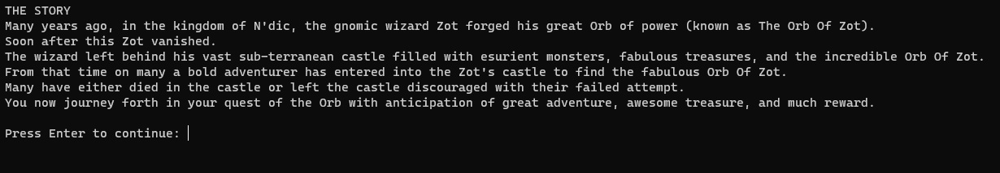
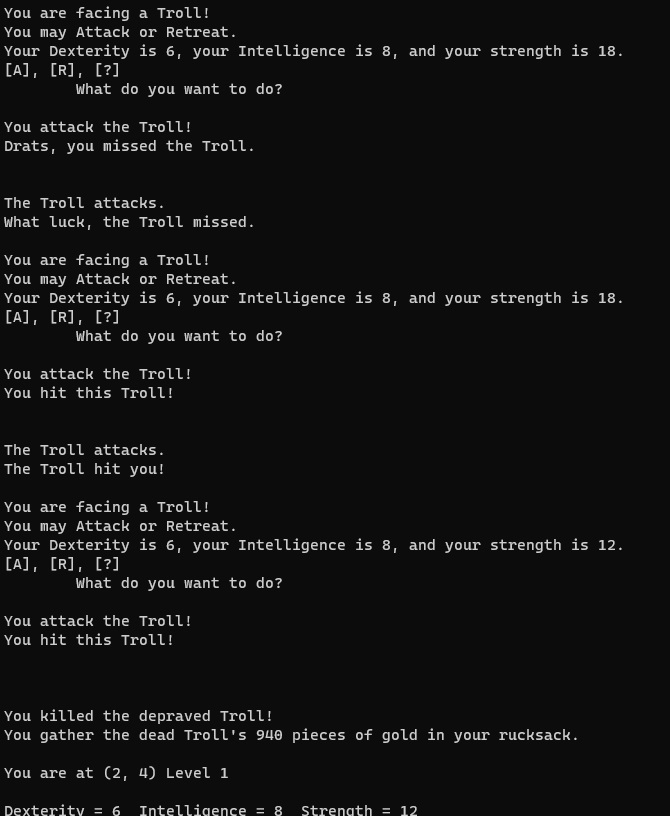

# Wizard's Castle (40th Anniversary PowerShell Edition)
> A remake of the 1980 Exidy Sorcerer game written by JOSEPH R. POWER
> The instructions are included with the game.
> I stayed mostly true to the original, but added some additional functionality.

## Table of contents
* [General info](#general-info)
* [Screenshots](#screenshots)
* [Technologies](#technologies)
* [Setup](#setup)
* [Features](#features)
* [To-do-list](To-do-list)
* [Status](#status)
* [Inspiration](#inspiration)
* [Contact](#contact)

## General info
A full PowerShell remake of the 1980 classic, the Wizard's Castle.
In addition I have added some new elements to the game.
I deeply enjoyed this game growing up and wanted to make it for a modern programming language.
I chose PowerShell as it gave me an opportunity to program in a language I have grown to love.
Exidy Sorcerer game code originally published in the July 1980 edition of Recreational Computing.
https://archive.org/details/1980-07-recreational-computing

## Screenshots

## Technologies
* Heavily tested in PowerShell 7.0.3

## Setup
Clone the repository and run The_Wizards_Castle.ps1.
At minimum you need the 3 files:
    The_Wizards_Castle.ps1
    New-Character.psm1
    Instructions.txt

## Features
Game is fully playable.
* Added support for Random maps
* Added additional game messages
* Added non-interactive elements to empty rooms

## To-do-list
* Split code up into smaller files
* Add addtional monsters, spells and curses
* Other possibilities...

## Status
Project is: _finished_

## Inspiration
Project based on the 1980 Exidy Sorcerer game written by JOSEPH R. POWER

## Contact
Created by Daniel Kill [@yourwishismine](https://twitter.com/yourwishismine)
